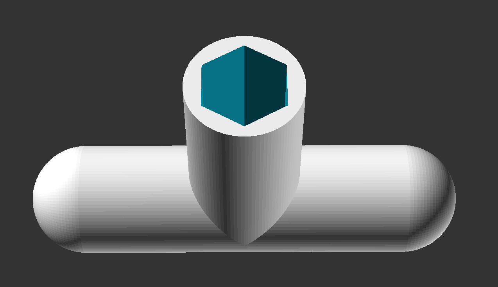

# Nuts

3D Printable T-Bar Nut Driver for all your pots-n-jacks. For Eurorack you generally need two sizes: 11mm for pots and 8mm for jacks. Plastic is good as you don't scratch your precious faceplate!

## Parameters

### nut_diagonal

Size of the target nut in mm.  
Measured from flat to flat.

### nut_sides

How many sides does the nut have?  
Generally six!

### bar_length

How wide do you want the handle?

### height

The height of the socket.

### wall

The thickness of the wall. A thicker wall creates a stronger tool but you might want to check how much space you have. How thin you can make this depends on the quality of your print and material.

### diagonal_addon

To make sure the tool slides nicely over the nut it helps to add quarter of a mil or so to the socket diameter.

## Licence

Do What the Fuck You Want To Public License (WTFPL)

